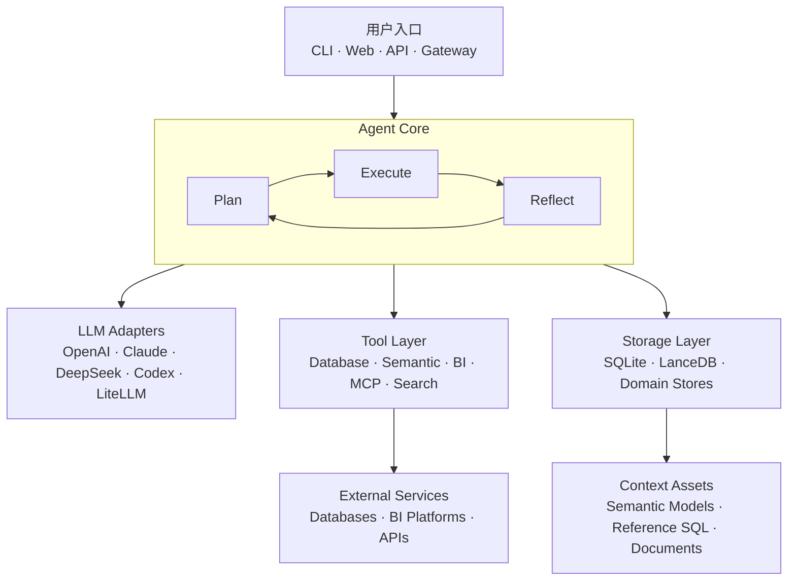

# DA

> 面向数据工程与业务分析的智能数据工作台：用自然语言连接数据库、生成并执行 SQL、检索语义上下文，并将分析过程组织为可追踪的多步骤工作流。

DA 面向数据工程师、数据分析师和需要自助取数的业务团队。它将大语言模型、数据库工具、语义层、知识库和可视化能力组合在同一个 Agent 工作流中，让用户可以从一个业务问题出发，完成数据理解、查询生成、结果校验和洞察输出。

当前版本：`0.2.6` · 

## 核心能力

- **自然语言分析**：用业务语言描述问题，由 Agent 自动规划分析步骤。
- **SQL 生成与执行**：连接 DuckDB 等数据源，生成、校验并运行查询。
- **多步骤推理**：通过 Plan → Execute → Reflect 工作流持续修正执行结果。
- **语义上下文**：使用语义模型、指标、参考 SQL 和外部知识增强生成质量。
- **数据对比与可视化**：支持指标比较、图表结果和仪表盘组装。
- **多种使用入口**：提供终端交互、Web 工作台、REST API、MCP Server 和消息网关。
- **模型适配层**：通过统一接口接入 OpenAI、Claude、DeepSeek、Codex 和 LiteLLM 兼容模型。
- **可扩展工具系统**：数据库、搜索、BI、MCP 和技能工具均通过注册与权限层管理。

## Web 工作台

项目包含一套重新设计的 Web 界面：

- 分析流程侧栏
- AI 对话工作区
- 数据上下文与快捷提问
- 明暗主题切换
- 桌面端与移动端响应式布局

Web 页面入口位于 `da/cli/web/templates/index.html`，继续复用现有 FastAPI 服务和聊天组件协议。


## 系统架构



核心目录：

| 目录 | 说明 |
| --- | --- |
| `da/agent/` | Agent 工作流、节点和 Plan/Execute/Reflect 调度 |
| `da/tools/` | 数据库、语义层、BI、MCP、搜索和技能工具 |
| `da/models/` | LLM 模型适配器 |
| `da/storage/` | SQLite、LanceDB 和领域数据存储 |
| `da/prompts/` | SQL、规划和对话 Prompt 模板 |
| `da/cli/` | 终端界面和 Web 工作台 |
| `da/api/` | FastAPI 路由、服务和流式响应 |
| `da/gateway/` | Slack、飞书等消息渠道适配 |
| `tests/` | 单元、集成和回归测试 |
| `sample_data/` | 本地演示数据库和样例数据 |

## 环境要求

- Python 3.12
- 推荐使用 [uv](https://docs.astral.sh/uv/) 管理环境
- 至少一个可用的 LLM Provider API Key

项目自带 DuckDB 演示数据库，因此首次体验不需要额外部署数据库。

## 快速开始

### 1. 获取代码

```bash
git clone <your-repository-url>
cd <repository-directory>
```

将占位地址替换为发布后的 GitHub 仓库地址。

### 2. 安装依赖

推荐使用 uv：

```bash
uv sync --dev
```

也可以使用 Python 虚拟环境：

```bash
python3.12 -m venv .venv
source .venv/bin/activate
python -m pip install -e .
```

Windows PowerShell 激活命令：

```powershell
.venv\Scripts\Activate.ps1
```

### 3. 配置模型密钥

默认配置使用 DeepSeek，并通过环境变量读取密钥：

```bash
export DEEPSEEK_API_KEY="your-api-key"
```

如果使用 OpenAI，请修改 `conf/agent.yml` 中的目标模型，并设置：

```bash
export OPENAI_API_KEY="your-api-key"
```

不要将真实密钥直接写入配置文件或提交到 Git。

### 4. 启动 Web 工作台

```bash
uv run da --web --datasource demo
```

默认访问地址：

```text
http://localhost:8501
```

指定端口：

```bash
uv run da --web --datasource demo --port 9000
```

## 其他运行方式

### 交互式终端

```bash
uv run da --datasource demo
```

### 单次分析

```bash
uv run da --datasource demo --print "概览当前数据集中的主要表和关键指标"
```

### REST API

```bash
uv run da-api \
  --config conf/agent.yml \
  --datasource demo \
  --host 0.0.0.0 \
  --port 8000
```

启动后可访问：

- API 文档：`http://localhost:8000/docs`
- OpenAPI 描述：`http://localhost:8000/openapi.json`

### MCP Server

HTTP 模式：

```bash
uv run da-mcp --datasource demo --host 0.0.0.0 --port 8000
```

stdio 模式：

```bash
uv run da-mcp --datasource demo --transport stdio
```

## 数据源配置

演示数据源定义在 `conf/agent.yml`：

```yaml
services:
  datasources:
    demo:
      type: duckdb
      uri: duckdb:///sample_data/duckdb-demo.duckdb
```

接入新的数据源时，请在 `services.datasources` 下增加配置，并通过数据源名称启动：

```bash
uv run da --web --datasource <datasource-name>
```

数据库密码、Token 和私有连接信息应通过环境变量注入，例如：

```yaml
password: ${DATABASE_PASSWORD}
```

## 工作流与知识上下文

Agent 工作流定义在 `da/agent/workflow.yml`，不同节点负责规划、SQL 生成、执行、比较、可视化和反馈。

可用于增强分析效果的上下文包括：

- 语义模型
- 指标定义
- 参考 SQL
- SQL 模板
- 外部知识文档
- 数据库 Schema 元数据

初始化知识库示例：

```bash
uv run da-agent bootstrap-kb \
  --datasource demo \
  --components metadata semantic_model reference_sql
```

## 开发与测试

运行测试：

```bash
uv run pytest
```

只运行快速单元测试：

```bash
uv run pytest tests/unit_tests
```

代码检查与格式化：

```bash
uv run ruff check .
uv run ruff format .
```

项目中的部分集成、夜间和回归测试需要外部数据库或真实模型凭据。

## 安全与隐私

- 不要提交 `.env`、`.da/`、会话数据库、日志或模型 Trace。
- 不要在 Issue、日志、截图或测试数据中暴露真实 API Key。
- 对外发布数据库文件前，确认其中不包含真实业务数据或个人信息。
- 如果密钥曾被提交到 Git 历史，仅删除文件是不够的；应立即撤销并重新生成密钥。
- 面向公网运行 API 或 Web 服务前，请配置认证、网络访问控制和反向代理。

仓库根目录的 `.gitignore` 已默认排除常见密钥文件、本机配置、虚拟环境、运行数据和缓存。

## 项目状态

当前项目处于 Alpha 阶段，接口、配置结构和工作流可能继续调整。用于生产环境前，请完成权限、审计、备份、模型成本和数据库只读策略评估。

## License

项目源码声明采用 Apache License 2.0。公开发布前，请确认仓库根目录包含完整的许可证文件，并保留源文件中的版权信息。
